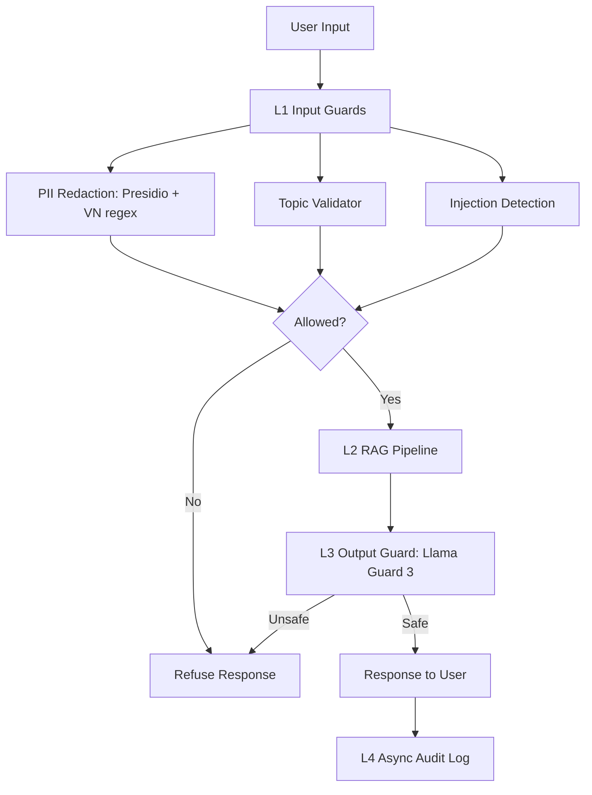

# Production Blueprint

## SLOs

| Metric | Target | Alert Threshold | Severity |
|---|---:|---|---|
| Faithfulness | >= 0.85 | < 0.80 for 30 min | P2 |
| Answer Relevancy | >= 0.80 | < 0.75 for 30 min | P2 |
| Context Precision | >= 0.70 | < 0.65 for 1h | P3 |
| Context Recall | >= 0.75 | < 0.70 for 1h | P3 |
| P95 Latency with guardrails | < 2.5s | > 3s for 5 min | P1 |
| Guardrail Detection Rate | >= 90% | < 85% | P2 |
| False Positive Rate | < 5% | > 10% | P2 |

## Architecture

Latency budget:

| Layer | Target P95 | Notes |
|---|---:|---|
| L1 Input guards | < 50ms | Regex and topic checks should run before LLM calls. |
| L2 RAG | < 2.0s | Main generation bottleneck. |
| L3 Output guard | < 100ms API / < 50ms local | Depends on deployment mode. |
| L4 Audit log | async | Not counted in response latency. |

## Alert Playbook

### Incident 1: Faithfulness drops below 0.80

Severity: P2

Detection: Continuous eval alert from RAGAS sampled production queries.

Likely causes:

1. Retriever returns weak chunks.
2. Prompt changed without eval gate.
3. Corpus was updated without re-indexing.

Investigation steps:

1. Check context precision and context recall for the same window.
2. Compare current prompt version with the last passing prompt.
3. Inspect recent corpus/index updates.

Resolution:

- Re-index corpus if retrieval metrics dropped.
- Roll back prompt if generation changed.
- Increase `top_k` or add reranking for multi-hop failures.

SLO impact: Track time to detect and time to recover.

### Incident 2: Guardrail false positives exceed 10%

Severity: P2

Detection: Monitoring shows legitimate queries being refused.

Likely causes:

1. Topic validator threshold is too strict.
2. Injection regex catches normal educational wording.
3. Domain topics are incomplete.

Investigation steps:

1. Sample refused legitimate queries.
2. Group false positives by guardrail component.
3. Re-run the legitimate query regression suite.

Resolution:

- Adjust topic list and thresholds.
- Narrow overly broad regexes.
- Add false-positive regression tests.

SLO impact: User task completion and trust degradation.

### Incident 3: P95 latency exceeds 3 seconds

Severity: P1

Detection: Latency dashboard and synthetic benchmark alert.

Likely causes:

1. LLM provider latency spike.
2. Output guard API slow.
3. Retriever index degraded.

Investigation steps:

1. Break down latency by L1/L2/L3.
2. Compare provider latency with baseline.
3. Inspect retriever query time.

Resolution:

- Fail over to cheaper/faster judge or output guard route.
- Cache topic embeddings and frequent retrievals.
- Reduce sampled eval rate during provider incident.

SLO impact: Direct user-facing latency breach.

## Monthly Cost Estimate

Assumption: 100k queries/month.

| Component | Unit Cost | Volume | Monthly Cost |
|---|---:|---:|---:|
| RAG generation GPT-4o-mini | $0.001/query | 100k | $100 |
| RAGAS continuous eval | $0.01/query | 1k | $10 |
| LLM Judge tier 2 | $0.001/query | 10k | $10 |
| LLM Judge tier 3 | $0.05/query | 1k | $50 |
| Presidio self-hosted | $0 | 100k | $0 |
| Llama Guard self-hosted GPU | $0.30/hour | 720h | $216 |
| Total |  |  | $386 |

Cost optimization opportunities:

- Use small judge model for routine monitoring and reserve stronger models for dispute cases.
- Tune continuous eval sampling rate by traffic and risk.
- Use API-based Llama Guard for low volume; self-host only when utilization justifies GPU cost.
